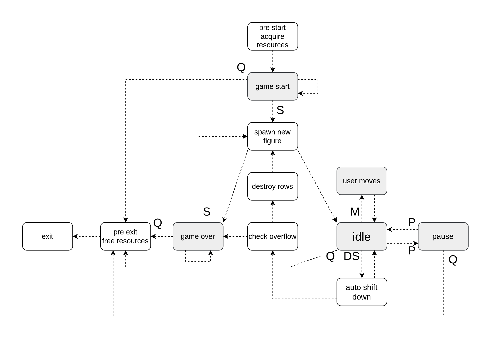

# Tetris
C implementation of NES-like tetris.

## Implementation notes
### gui - lib
The program is divided into two independent parts - cli and the game library. The interaction is regualted with an API - game/lib.h describes types for the gui to interpret the game status and methods to keep the status up to date.

### FSM
To formalize the game logic a finite-state machine was implemented. All the possible states of the machine and allowed input signals are defined in the game/tetris/fsm.h header. \
 \
FSM transition graph

The machine states that are capable of handling user inputs are in grey. If the input is given to the machine while it is in the 'intermediate' (white) state, it will commit transitions until a 'grey' state is achived and the signal is handled.
